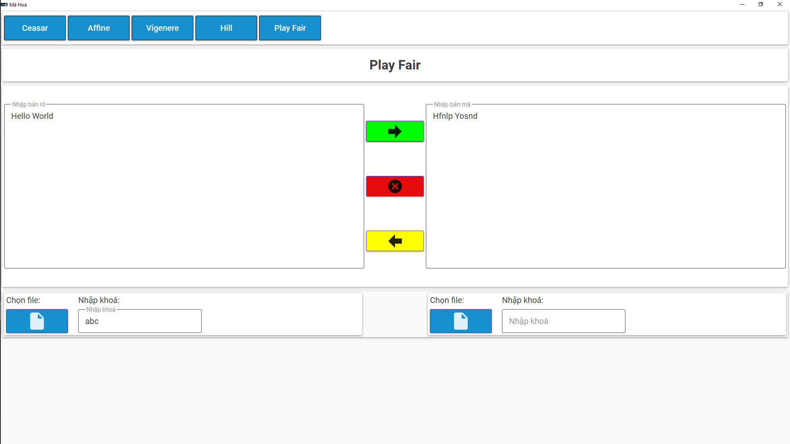
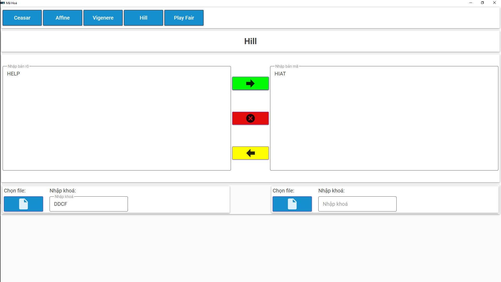

> [!IMPORTANT]
> THIS IS JUST A PROJECT FOR STUDYING PURPOSE
# Cryption (Self-project)
### Description
  - This project use to encode and decode string base on classic cryption: **Ceasar, Affine, Vigenere, Hill, Play Fair**
### Technology
  - C#, WPF
### UI
  - Ceasar
  

  - Affine
  
  - Vigenere
  
  - Play Fair
  
  - Hill
  
### HOW TO RUN
  >   - Install .NET 6 from [.NET 6](https://dotnet.microsoft.com/en-us/download/dotnet/6.0)
  >   - Clone project from github:```git clone https://github.com/minhthuan26/Cryption.git```
  >   - Open project on Visual Studio _[_**If you don't have it, please install: [Visual Studio](https://visualstudio.microsoft.com/)]*
  >   - Press ```Ctrl + F5``` to run
